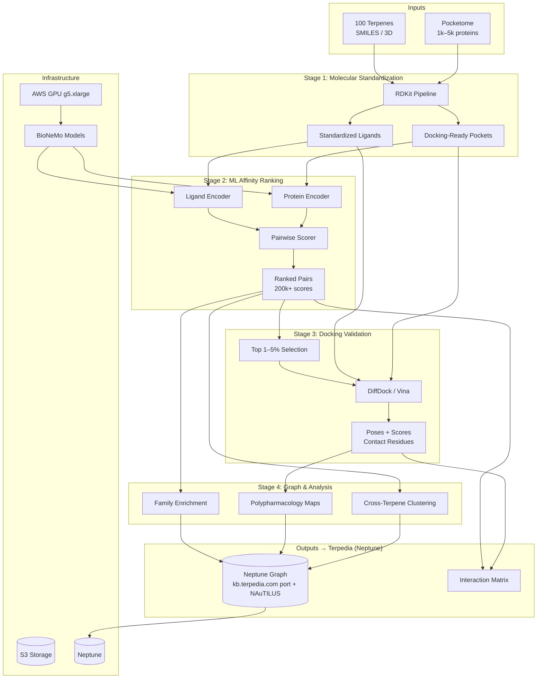
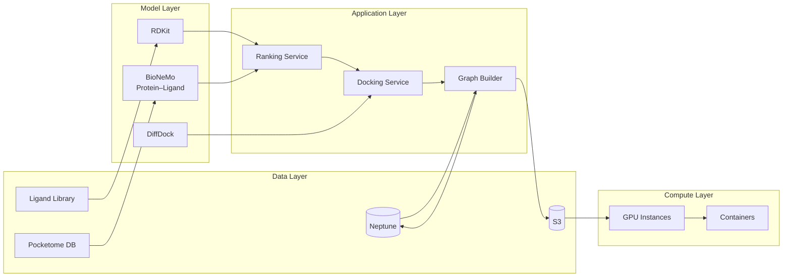

# NAuTILUS System Diagram  
**For NVIDIA Inception & Internal Technical Planning**

---

## Diagram: High-Level Pipeline & Data Flow

---

## Diagram: Component Stack (NVIDIA-Friendly)

---

## Narrative Description for Slides / One-Pagers

**NAuTILUS pipeline (left to right):**

1. **Inputs:** Curated 100 terpenes (SMILES/3D) and human pocketome (1k–5k pockets from PDB/AlphaFold).
2. **Standardization:** RDKit canonicalization, protonation, 3D conformers; pocket cleaning and definition. Outputs feed both ML and docking.
3. **ML ranking:** Protein and ligand encoders (BioNeMo-compatible) produce embeddings; batched pairwise scoring yields 200k+ interaction scores and per-terpene ranked protein lists.
4. **Docking:** Top 1–5% of ranked pairs per terpene are passed to DiffDock (and optionally Vina); outputs are poses, scores, and contact residues.
5. **Analysis:** Family enrichment, polypharmacology mapping, and cross-terpene clustering run on ranked and docked results.
6. **Outputs:** Ranked matrix, docking subset, and graph (nodes: Terpene, Protein, Family, Pathway; edges: predicted_binding, docked_binding, family_enrichment) written to **Amazon Neptune**. The Terpedia SPARQL KB (kb.terpedia.com) is ported to Neptune; NAuTILUS results are captured there.

**Infrastructure:** AWS GPU instances (e.g., g5.xlarge), S3 for storage, **Neptune** for the Terpedia graph (SPARQL), containerized BioNeMo and RDKit, DiffDock for pose prediction.

---

*Use the Mermaid blocks in Markdown viewers (GitHub, Notion, etc.) or export to PNG/SVG for NVIDIA briefings and internal docs.*
