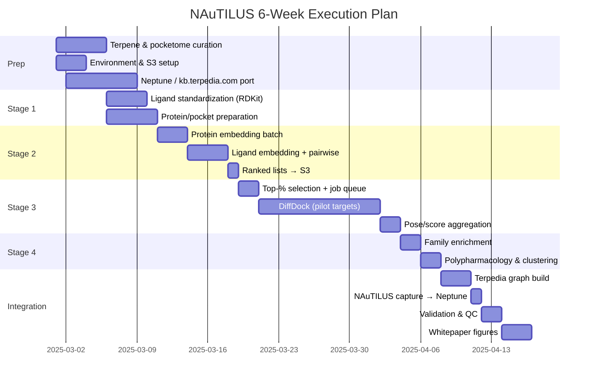

# NAuTILUS — 6-Week Execution Plan  
**Gantt Timeline (Pilot → Deliverables)**

---

## Mermaid Gantt (Copy-Paste Ready)

---

## Week-by-Week Summary

| Week | Focus | Key Outputs |
|------|--------|-------------|
| **1** | Curation, env, Stage 1 | Terpene list (100); pocketome (1k–2k); S3 layout; standardized ligands & pockets |
| **2** | Stage 2 (ML ranking) | Protein/ligand embeddings; 200k pairwise scores; ranked lists per terpene on S3 |
| **3** | Stage 3 start | Top-% selection; DiffDock job queue; start docking runs |
| **4** | Stage 3 continue | Bulk DiffDock completion; pose/score tables; contact residues |
| **5** | Stage 4 + integration | Enrichment; polypharmacology maps; cross-terpene clustering; Terpedia graph build; NAuTILUS capture to Neptune |
| **6** | Validation & deliver | Neptune/kb.terpedia.com verification; QC vs ChEMBL/BindingDB; negative controls; whitepaper figures; final deliverable package |

---

## Dependencies (Critical Path)

1. **Prep** → Stage 1 (standardization) must finish before embeddings.  
2. **Stage 1** → Stage 2 (both ligand and protein prep done before full pairwise ranking).  
3. **Stage 2** → Stage 3 (ranked lists required for top-% and docking queue).  
4. **Stage 3** → Stage 4 (docked set required for enrichment and polypharmacology).  
5. **Stage 4** → Integration (graph + figures depend on all analysis outputs).

Docking (Stage 3) is the longest block; parallelize across multiple GPU instances to keep to ~2 weeks.

---

## Milestones

| Milestone | Target End |
|-----------|------------|
| M1: Standardized library + pocketome in S3 | End of Week 1 |
| M2: Full ML ranking complete; ranked lists in S3 | End of Week 2 |
| M3: Docking complete for pilot set | End of Week 4 |
| M4: Graph + enrichment + clustering complete; NAuTILUS data in Neptune | End of Week 5 |
| M5: Neptune/kb.terpedia.com verified; validation done; figures and deliverable package | End of Week 6 |

---

## Scaling to $500 Tier

- Extend **Stage 1** by ~1 week (larger pocketome).  
- **Stage 2:** +1–2 days (5k proteins).  
- **Stage 3:** +2–3 weeks (more targets per terpene) or more parallel GPUs.  
- **Stage 4 / Integration:** +3–5 days (larger enrichment and clustering).  

Total expanded timeline: **~10–12 weeks** if docking is not further parallelized.

---

*Adjust start date in the Mermaid `dateFormat` and task dates as needed for your kickoff.*
